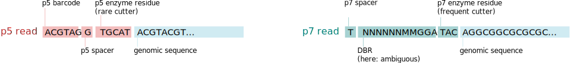

.. _parameters:

==========
Parameters
==========

Detailed list of parameters:

Naming and Output Parameters
----------------------------

These option allow to modify the general handling of the data set, where it is stored,
how it is named and similar aspects.

``--name NAME``
    Name for the data set. If none is given, the name ddRAGEdataset will be used.
    Each data set will be written to an own folder in the output path to avoid naming conflicts.
    This name will appear in the final file name identifying the data set like:

    .. code:: bash

        $ ddrage
        ddRAGEdataset_TAGCTT_1.fastq

        $ ddrage --name foobar
        foobar_TAGCTT_1.fastq

``-o OUTPUT_PATH_PREFIX --output OUTPUT_PATH_PREFIX``
    Prefix of the output path, i.e. the folder in which the output files created by ddRAGE are stored.
    As default, the current folder is used.

    .. code:: bash

        $ ddrage -o /tmp/rage_data
        $ cd /tmp/rage_data
        $ ls
        ddRAGEdataset_GGCTAC_1.fastq ddRAGEdataset_GGCTAC_2.fastq
        ddRAGEdataset_GGCTAC_barcodes.txt ddRAGEdataset_GGCTAC_gt.yaml logs/
        

Dataset Parameters
------------------

These option specify the content of the data set.
This includes the number of loci and individuals, the simulated coverage quality
as well as coverage boundaries.

``-n NR_INDIVIDUALS, --nr-individuals NR_INDIVIDUALS``
    Number of individuals in the sample (Default: 3).
    The specific individuals will be extracted from the barcodes file,
    which poses an upper bound on the number of individuals.
    In the default barcode set (``full.txt``) a maximum of 24 individuals
    can be picked per p7 barcode.
    To increase the number the barcodes file has to be modified or a different barcodes
    file needs to be chosen. The file ``huge.txt`` can support up to 1462 individuals,
    but uses barcodes of length 10 to keep individuals distinguishable.

``-l LOCI, --loci LOCI``
    Number of loci for which reads will be simulated for the selected individuals (Default: 3)
    or path to FASTA file. If a FASTA file is given, the sequences contained will be used
    to create the locus sequences. In this case the number of loci simulated is the number of
    sequences in the file.
    
    This parameter greatly influences the size of the resulting data set.
    

``-r READ_LENGTH, --read-length READ_LENGTH``
    Total sequence length of the reads (including overhang, barcodes, etc., Default: 100).

    This refers to the length of reads as they are returned by the sequencer
    and has to be distinguished from sequence length by which we refer to the 
    sequence information from the individual. Consider the following p5 read::

        
        ACGTGA G TAC NNNNNNNNNNNNNNNNNNNNNNNNNNNNNNNNNNNNNNNN
        |      | |   |
        |      | |   genomic sequence (40 bp)
        |      | enzyme overhang (3bp)
        |      spacer (1bp)
        barcode (6bp)
        
        -> read length = 6 + 1 + 3 + 40 bp = 50bp

    Mind that the length of the spacer sequence depends on the individual.
    Hence, p5 sequences in the same data set with the same read length will
    yield different length sequences. To trim all genomic sequences to
    the same length use the ``--truncate-at`` parameter.
    As the generated data sets are simulated to already be demultiplexed 
    using the p7 index (barcode) there is no variation in the p7 sequence length,
    as all individuals use the same p7 spacer sequence, which are linked to
    the barcode sequence (unless the ``--combine-p7-bcs`` parameter is used).

    The officially supported and well tested range of read lengths is 50 - 500bp.
    However, shorter or longer lengths are possible and will most likely also produce
    reasonable results.

       
``-c COV, --coverage COV``
    Expected (target) coverage that will be created by normal duplication and snps (Default: 30).

    This is the targeted sequencing depth dₛ.
    In actual ddRAD data sets this value is seldom reached precisely, hence a random process (coverage model)
    is used in order to simulated more realistic detests.
    The expected value of both available models (Poisson and Beta-binomial) is dₛ, but deviations to both sides,
    more reads or less reads than expected, can be reached.
    The model can be specified with the ``--coverage-model`` parameter.
    
    .. figure:: ../figures/read_coverage_distribution.svg
        :width: 95%
        
        Coverage profiles for valid (1, 2) and invalid (3,4) locus types.
        Valid loci sample coverage values from a coverage model,
        while singletons always have a coverage of 1 (before adding PCR copies)
        and HRL receive a very high coverage.

``--hrl-number``
    Number of HRLs that will be added, given as fraction of total locus size (Default: 0.05).
    Example: ``-l 100 --hrl-number 0.1`` for 10 HRLs.

``--no-singletons``
    Disable generation of singleton reads. If set, no singletons will be simulated.

``--diversity DIVERSITY``
    Handles the number of alleles created per locus.
    Default: 1.0, increase for more alleles / genotypes per locus.

    This will be used as the λ parameter for a Zero Truncated Poisson Distribution,
    which is used to pick a number of different alleles for the locus.
    A higher λ means more alleles, thereby increasing the possible genotypes.

    .. figure:: ../figures/ztpd.svg
        :width: 95%
        
        Probability density for three values for λ, along with the expected value (E) for the respective parameter.
        This is equivalent to the expected (average) number of alleles at all loci.

    Example: Three out of six individuals receive a heterozygous SNP event for a specific locus. 
    For each individual two alleles are chosen from the model. Using λ = 1.0 the expected number of
    different alleles will be 3: the true sequence (also called root allele, R), and 2 mutation alleles (the expected value
    of ZTPD(1.0) is 1.58: A, B). So only three different homozygous genotypes can be created: RA, RB, AB.
    Using λ = 5.0 the expected number of alleles is 6 and the number of different combinations rises to 10.

``--gc-content``
    GC content of the generated sequences. This is used to create a skewed distribution of bases
    that satisfies the desired GC content. The bases within a class (GC and AT respectively) are
    chosen uniformly. The default value is 0.5

    Example 1: The default value is 0.5, meaning that 50% of the bases will be GC, the rest will be AT.
    Within these classes the probability is chosen uniformly, yielding probabilities of 0.25 for each base.

    Example 2: ``--gc-content 0.1`` the probabilities for A and T are both 0.45 ((1 - 0.9) / 2) while the
    probabilities of C and G are 0.05 = 0.1 / 2.

``-q QUALITY_MODEL, --quality-model QUALITY_MODEL``
    Model from which quality values will be sampled.
    The model is given as a :ref:`.qmodel file <qmodel_filespec>`.
    

``--single-end, --se``
    Write a single-end dataset. Only writes a p5 FASTQ file. Default: False

``--overlap, --ol``
    Overlap factor (between 0 and 1.0) of randomly generated reads.
    This value describes how much the ends of the p5 and the p7 read
    will overlap. Default 0

    .. image:: ../figures/overlap.svg
               

``--multiple-p7-barcodes, --combine-p7-bcs``
    Combine individuals with multiple p7 barcodes in one output file.
    This simulates the bahaviour of an unsplit read file.
    Files created like this can be split up using the :ref:`split_by_p7_barcode tool <split_tool>`.
    Default: False
    

Coverage Model Parameters
-------------------------

``--coverage-model {PD, BBD}``
    Mathematical model used to sample coverage values (Default: betabinomial).
    Currently two models are supported. The BBD model (default) uses
    a Beta-binomial distribution which creates coverage values with 
    high variance and can be modeled to different coverage profiles using
    the ``--BBD-alpha`` and ``--BBD-beta`` parameters.
    The PD model uses a Poisson distribution to sample coverage values.
    This creates a less variant set of distributions and creates easier instances
    for analysis.

``--BBD-alpha``
    Alpha parameter of the Beta-binomial distribution (Default: 6).
    Higher values increase the left tailing of the coverage distribution,
    if the BBD model is used.

``--BBD-beta``
    Beta parameter of the Beta-binomial distribution (Default: 2).
    Higher values increase the right tailing of the coverage distribution,
    if the BBD model is used.

``--max-pcr-copies MAX_PCR_COPY_NR``
    Maximum number of PCR copies that can be created for each finalized 
    (potentially mutated and multiplied) read (Default: 3).

``--hrl-max-cov MAX_COVERAGE, --hrl-max-coverage MAX_COVERAGE``
    Maximum coverage for Highly Repetitive Loci (HRLs) (Default: 2000). The minimum coverage is determined as μ + 2σ of the main coverage generating function.

Sequence Parameters
-------------------
These options allow to change the auxiliary sequences used to construct the reads.
Please note, that both the overhang and the restriction site of the enzymes used have to be specified.
A list of enzymes and their associated parameters can be found :doc:`here <enzymes>`.

``-d DBR, --dbr DBR``
    DBR sequence, used as unique molecular identifier (UMI), in IUPAC ambiguity code. Default: 'NNNNNNMMGGACG'

``--p5-overhang P5_OVERHANG``
    Sequence of the p5 overhang. Default: 'TGCAT' (*NsiI*)

``--p7-overhang P7_OVERHANG``
    Sequence of the p7 overhang. Default: 'TAC' (*Csp6I*)

``--p5-rec-site P5_REC_SITE``
    Sequence of the p5 recognition site. Default: 'ATGCAT' (*Csp6I*)

``--p7-rec-site P7_REC_SITE``
    Sequence of the p7 recognition site. Default: 'GTAC' (*NsiI*)

``-b BARCODE_SET, --barcodes BARCODE_SET``
    Path to barcodes file or predefined barcode set like 'barcodes', 'small' or 'full'. Default: 'barcodes', a generic population.
    See :ref:`input formats <barcode_filespec>` for more information.

Event Probabilities
-------------------
The following parameters influence the probabilities of different event occurring.
This includes individual event types, the probabilities of different mutation types,
zygosity, and several other aspects:

``--event-probabilities``
    Probability profile for the distribution of event types (common, dropout, mutation; in this order).
    Each entry can be given as a float or a string of python code (see example above) which is helpful for small probability values.

    Example::

        $ ddrage --event-probabilities 0.9 0.05 0.05
        -> common 90%, dropout 5%, mutation 5% (Default) 

``--mutation-type-probabilities``
    Probability profile for the distribution of mutation types (snp, insertion, deletion, p5 na alternative, p7 na alternative, p5 na dropout, p7 na dropout; in this order).
    Each entry can be given as a float or a string of python code (see example above) which is helpful for small probability values.

    Example::

        $ ddrage --mutation-type-probabilities 0.8999 0.05 0.05 '0.0001*0.001' '0.0001*0.05' '0.0001*0.899' '0.0001*0.05'
        -> snp 89.99%, insertion 5%, deletion 5%, p5 na alternative 0.00001% , p7 na alternative 0.0005%, p5 na dropout 0.00899%, p7 na dropout 0.0005% (Default)

``--prob-heterozygous PROB_HETEROZYGOCITY``
    Probability of mutations being heterozygous. Default: 0.5

``--prob-incomplete-digestion PROB_INCOMPLETE_DIGESTION``
    Probability of incomplete digestion for common and mutation type individuals. Default: 0.1

``--rate-incomplete-digestion PROB_INCOMPLETE_DIGESTION``
    Expected fraction of reads that are being lost in the event of Incomplete Digestion. Default: 0.2

``--prob-pcr-copy PROB_PCR_COPY``
    Probability that a (potentially mutated and multiplied) read will receive pcr copies.
    This influences the simulated pcr copy rate. Default: 0.2

``--hrl-pcr-copies HRL_PCR_COPIES``
    Probability of PCR copies for HRL reads in relation to normal reads. Default: 0.9, i.e. the probability for a PCR copy of a HRL read is ``prob_pcr_copy * hrl_pcr copies = 0.2 * 0.9 = 0.18``
    
``--singleton-pcr-copies SINGLETON_PCR_COPIES``
    Probability of PCR copies for singleton reads in relation to normal reads. Default: 1/3, i.e. the probability for a PCR copy of a singleton read is ``prob_pcr_copy * singleton_pcr_copies = 0.2 * (1/3) = 0.0666...``

``-e PROB_SEQ_ERROR, --prob-seq-error PROB_SEQ_ERROR``
    Probability of sequencing substitution errors. Default: 0.01

Debugging and User Output
-------------------------

``-v, --verbose``
    Increase verbosity of output:

    -v: Show progress of simulation, including current simulation phase and a percentage of loci finished.
    -vv: Print used parameters after simulation. This is similar to the content of the annotation output file.
    -vvv: Show details for each simulated locus, including the simulated types.

``-z, --zip``
    Write reads as `.fastq.gz` files. The .gz suffix is automatically added.
    

``--DEBUG``
    Set debug-friendly values for Locus distribution (Probabilities for common, dropout, mutation are all 1/3).

``--version``
    Print the version number.
